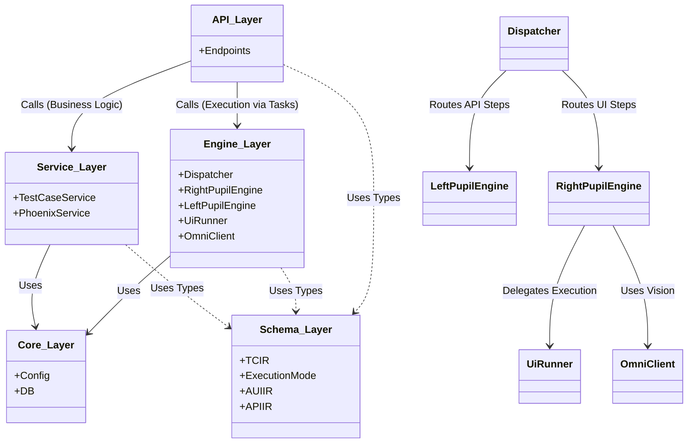

<p align="center">
  
</p>

<h1 align="center">重明 (ChongMing)</h1>

<p align="center">
  <strong>🔮 神经-凤凰架构 AI 自动化测试平台</strong>
</p>

<p align="center">
  <a href="#核心特性">核心特性</a> •
  <a href="#架构概览">架构概览</a> •
  <a href="#快速开始">快速开始</a> •
  <a href="#模块说明">模块说明</a> •
  <a href="#文档">文档</a> •
  <a href="#贡献指南">贡献指南</a>
</p>

<p align="center">
  
  
  
  
</p>

---

## 📖 项目简介

**重明** 是一个基于大语言模型 (LLM) 的智能自动化测试平台，采用独创的 **"神经-凤凰"双脑架构** 和 **"三态生命周期"** 理念，实现从需求文档到可执行测试脚本的全流程自动化。

### 项目名称由来

> "重明"取自《山海经》中的神鸟，形似鸡，鸣声如凤，能逐虎豹，折邪除魔。
> 
> 寓意本平台如神鸟般拥有**双重视觉洞察力**（UI + API 双瞳），通过 AI 智能**发现和消除**软件缺陷。

---

## ✨ 核心特性

### 🧠 神经设计层 (Neural Design)
- **PRD → 用例**：自动解析需求文档，生成测试用例
- **AI 评审**：Critic Agent 评估用例质量
- **知识增强**：RAG 检索项目知识库

### 👁️ 双瞳引擎
- **右瞳 (UI)**：Visual-First 视觉优先定位策略
- **左瞳 (API)**：Swagger 解析 + RAG 用例增强
- **智能等待**：多信号融合页面稳定检测

### 🔥 凤凰涅槃层 (Phoenix Nirvana)
- **轨迹编译**：执行轨迹 → Pytest 脚本
- **意图注释**：LLM 添加业务语义
- **Git 集成**：自动提交到版本库

### 🚀 涡轮引擎 (Turbo)
- **极速施压**：Locust 分布式性能测试
- **实时指标**：RPS、P95/P99 延迟监控

### 🛡️ 智能运维
- **缺陷分析**：AI 根因分析 + Milvus 相似缺陷检索
- **自愈中心**：定位器自愈、数据自愈
- **VRT**：AI 驱动的视觉回归测试

---

## 🏗️ 架构概览

### 三态生命周期

```
         ┌─────────────────────────────────────────────────────────────┐
         │                    三态生命周期 (Three-State Lifecycle)      │
         │                                                             │
         │    ┌──────────┐       ┌──────────┐       ┌──────────┐      │
         │    │   液态   │  ──▶  │   固态   │  ──▶  │   气态   │      │
         │    │ (Liquid) │       │ (Solid)  │       │ (Gaseous)│      │
         │    │          │       │          │       │          │      │
         │    │ AI 探索  │       │ 脚本固化 │       │ 持续执行 │      │
         │    └──────────┘       └──────────┘       └──────────┘      │
         └─────────────────────────────────────────────────────────────┘
```

### 核心分层架构 (Core Layered Architecture)

本项目采用严格的 **API -> Services -> Engines** 分层架构，确保职责单一和代码解耦。



#### 层级职责 (Layer Responsibilities)

| 层级 | 职责描述 |
| :--- | :--- |
| **API Layer** | **仅处理 HTTP 请求/响应**。负责参数解析、验证和响应格式化，**严禁**包含任何业务逻辑。 |
| **Service Layer** | **业务逻辑核心**。负责用户数据管理、数据库事务 (CRUD)、权限校验和领域业务规则。 |
| **Engine Layer** | **执行与智能核心**。负责浏览器自动化 (Playwright)、视觉处理 (OmniParser)、LLM 编排和任务执行。 |
| **Schema Layer** | **数据契约**。存放所有跨层级共享的 DTO (Data Transfer Objects)、Enums 和中间表示 (IR)，用于打破循环依赖。 |

#### 开发守则 (Development Guidelines)

> [!IMPORTANT]
> 违反以下规则的 PR 将被拒绝合并。

1.  **单向依赖原则**：
    -   `Service` 可以调用 `Engine` (通常是通过 Task 或 Interface)。
    -   **严禁** `Engine` 反向导入 `Service`。如果需要共享数据结构，请移至 `app/schemas`。
2.  **执行逻辑归位**：
    -   所有涉及 "运行"、"执行"、"自动化" 的逻辑 (如 Runner, Parser, Client) 必须放入 `app/engines/`。
    -   禁止将执行逻辑放入 `app/services/`。

---

## 🚀 快速开始

### 前置要求

- Docker & Docker Compose
- Python 3.11+
- Node.js 20+
- 阿里云 DashScope API Key (通义千问)

### 1. 克隆仓库

```bash
git clone https://github.com/Little-H-lying-flat/ChongMing.git
cd ChongMing
```

### 2. 配置环境变量

```bash
cp deploy/.env.example deploy/.env

# 编辑 .env 文件，填入 QWEN_API_KEY
vim deploy/.env
```

### 3. 启动服务

```bash
# 启动所有服务
docker-compose -f deploy/docker-compose.yml up -d

# 查看日志
docker-compose -f deploy/docker-compose.yml logs -f api-gateway
```

### 4. 访问平台

| 服务 | 地址 |
|------|------|
| 前端 UI | http://localhost:3000 |
| API 文档 | http://localhost:8000/docs |
| Flower 监控 | http://localhost:5555 |
| Grafana | http://localhost:3001 |

---

## 📦 模块说明

| 模块 | 描述 | 技术栈 |
|------|------|--------|
| 神经设计层 | PRD 解析、用例生成 | LangChain, Qwen |
| 右瞳引擎 | UI 测试执行 | Playwright, OmniParser |
| 左瞳引擎 | API 测试执行 | httpx, RAG |
| 涡轮引擎 | 性能测试 | Locust |
| 凤凰涅槃层 | 脚本编译 | Jinja2, GitPython |
| 缺陷分析 | 根因分析 | LLM, Milvus |
| 自愈中心 | 自动修复 | AI Fallback |
| VRT | 视觉回归 | Pixelmatch |
| 任务调度 | 异步执行 | Celery, Redis |
| Agent 编排 | 工作流 | LangGraph |

---

## 📁 项目结构

```
ChongMing/
├── docs/                          # 文档
│   ├── designs/                   # 设计文档 (20份)
│   ├── issues/                    # 开发任务 (97个)
│   ├── 开发规范文档.md
│   ├── 测试策略文档.md
│   └── 接口对接文档.md
├── deploy/                        # 部署配置
│   ├── docker-compose.yml
│   ├── kubernetes/
│   ├── openapi.yaml
│   └── nginx/
├── backend/                       # 后端 (FastAPI)
│   ├── app/
│   │   ├── api/                   # API 端点
│   │   ├── services/              # 业务逻辑
│   │   ├── models/                # 数据模型
│   │   └── tasks/                 # Celery 任务
│   └── tests/
├── frontend/                      # 前端 (React)
│   └── src/
├── 重明架构白皮书.txt              # 架构设计
├── 重明技术规格书.txt              # 技术规范
└── 重明_详细设计说明书_*.txt       # 模块设计
```

---

## 📚 文档

### 设计文档
- [架构白皮书](./重明架构白皮书.txt) - 神经-凤凰架构详解
- [技术规格书](./重明技术规格书.txt) - 技术栈与规范

### 开发文档
- [开发规范](./docs/开发规范文档.md) - 代码风格、Git 规范
- [测试策略](./docs/测试策略文档.md) - 测试金字塔、覆盖率要求
- [接口对接](./docs/接口对接文档.md) - API 端点详细说明

### 部署文档
- [部署指南](./deploy/README.md) - Docker/K8s 部署
- [API 规范](./deploy/openapi.yaml) - OpenAPI 3.0

---

## 🔧 技术栈

### 后端
| 技术 | 版本 | 用途 |
|------|------|------|
| Python | 3.11+ | 主语言 |
| FastAPI | 0.109+ | Web 框架 |
| SQLAlchemy | 2.0+ | ORM |
| Celery | 5.3+ | 任务队列 |
| LangChain | 0.1+ | LLM 框架 |
| LangGraph | 0.0.5+ | Agent 编排 |
| Playwright | 1.40+ | 浏览器自动化 |
| Locust | 2.20+ | 性能测试 |

### 前端
| 技术 | 版本 | 用途 |
|------|------|------|
| React | 18+ | UI 框架 |
| Vite | 5+ | 构建工具 |
| TailwindCSS | 3+ | 样式 |
| Zustand | 4+ | 状态管理 |
| Monaco Editor | 0.45+ | 代码编辑器 |

### 基础设施
| 技术 | 版本 | 用途 |
|------|------|------|
| PostgreSQL | 15+ | 主数据库 |
| Redis | 7+ | 缓存/消息队列 |
| ChromaDB | latest | 知识向量库 |
| Milvus | 2.3+ | 缺陷向量库 |
| Nginx | alpine | 反向代理 |

---

## 🗓️ 开发路线图

### Phase 0: 基础设施 (Week 1-2)
- [x] 设计文档完成
- [ ] API 网关脚手架
- [ ] Celery 任务调度

### Phase 1: 左瞳点亮 (Week 3-4)
- [ ] API 测试引擎
- [ ] 数据工厂
- [ ] 环境管理

### Phase 2: 右瞳点亮 (Week 5-8)
- [ ] UI 测试引擎
- [ ] 智能等待机制
- [ ] 自愈中心

### Phase 3: 神经设计 (Week 9-11)
- [ ] PRD 解析器
- [ ] 用例生成器
- [ ] 缺陷分析器

### Phase 4+: 完整能力
- [ ] 凤凰涅槃层
- [ ] VRT 视觉回归
- [ ] 涡轮引擎
- [ ] Agent 编排

---

## 🤝 贡献指南

我们欢迎所有形式的贡献！

1. Fork 本仓库
2. 创建功能分支 (`git checkout -b feature/amazing-feature`)
3. 提交更改 (`git commit -m 'feat(scope): add amazing feature'`)
4. 推送分支 (`git push origin feature/amazing-feature`)
5. 创建 Pull Request

请阅读 [开发规范文档](./docs/开发规范文档.md) 了解代码风格和 Git 规范。

---

## 📄 开源协议

本项目采用 [GNU AGPL v3](LICENSE) 协议开源。

---

## 🙏 致谢

- [LangChain](https://github.com/langchain-ai/langchain) - LLM 应用框架
- [Playwright](https://playwright.dev/) - 浏览器自动化
- [FastAPI](https://fastapi.tiangolo.com/) - 高性能 Web 框架
- [OmniParser](https://github.com/microsoft/OmniParser) - 视觉识别

---

<p align="center">
  Made with ❤️ by ChongMing Team
</p>
