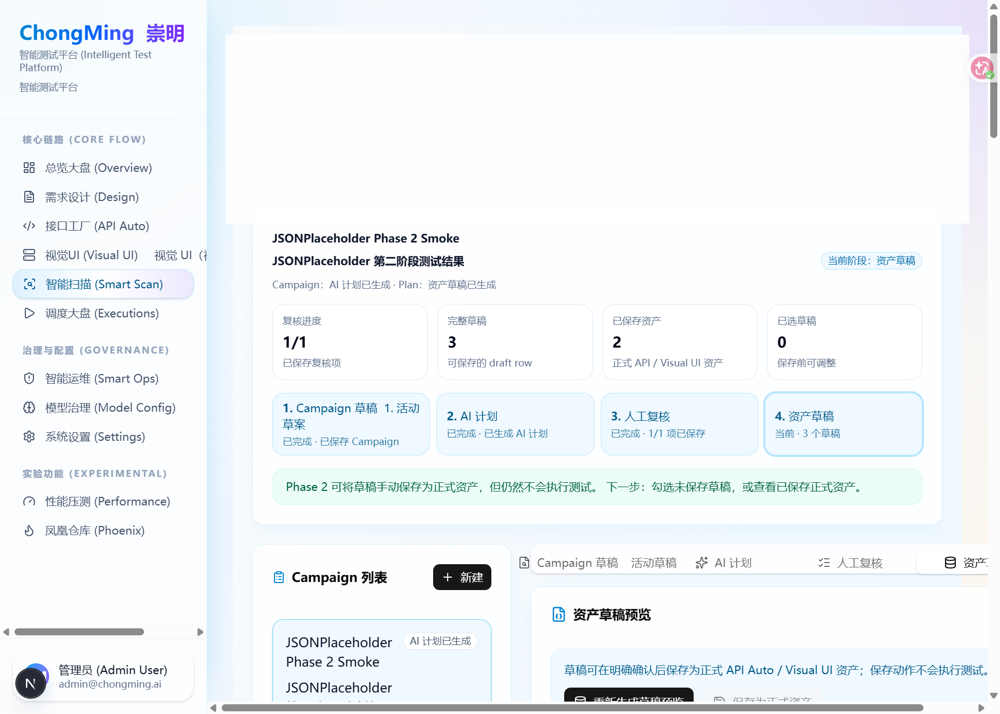

# 重明 (ChongMing)

重明是一个 AI 原生自动化质量工程平台，把需求解析、接口资产、UI/API 自动化执行、性能压测、视觉回归、缺陷分析和模型治理串成一条可追踪的智能测试流水线。

## 当前版本

- ChongMing 平台版本：v2.0.0
- 后端包版本：v2.0.0（`backend/app/__init__.py`）
- 前端应用版本：v0.1.1（`frontend/package.json`）
- 当前能力状态：Smart Scan Phase 2 已支持将人工确认的 API / Visual UI 资产草稿保存为正式可编辑资产；Phase 2 不创建 Execution，不自动执行测试。

## 项目一句话介绍

面向测试工程、质量平台和 AI Agent 落地场景，重明用“AI 生成 + 人工确认 + 可执行资产沉淀”的方式，把从需求到测试执行、报告、回归治理的链路产品化。

## 演示截图



Smart Scan 支持从目标页面和 API 线索生成扫描 Campaign、AI 计划、人工复核项和资产草稿；当前 Phase 2 只保存正式资产，不自动创建执行记录。

## 核心功能

- **Neural Design 需求解析**：从 PRD、自然语言或文档中提取测试场景和用例草稿。
- **Smart Scan 智能扫描**：统一管理 UI/API 线索、风险策略、人工复核和资产草稿确认。
- **API Asset 接口资产库**：导入 OpenAPI/Swagger 或手工维护接口资产，并生成 API Case IR v2 step。
- **Test Case 用例管理**：持久化 UI/API/HYBRID 用例，支撑回归执行和压测复用。
- **Midscene 视觉 UI 自动化**：通过 Midscene Runner、Playwright 和自然语言步骤执行 UI 自动化。
- **Left Pupil API 自动化**：解析接口依赖、发送请求、执行断言、提取变量。
- **Turbo 性能压测**：把 API 用例转换成 Locust 压测配置，查看 RPS、失败率和 P95 等指标。
- **Phoenix 回归治理**：把执行轨迹固化成脚本，管理基线、对比和自愈链路。
- **Smart Ops 智能运维**：进行模型配置、Token 监控、缺陷根因分析和相似缺陷检索。

## 项目亮点

- **AI Native 测试闭环**：不是单点脚本工具，而是覆盖需求、设计、资产、执行、报告和治理的质量工程平台。
- **双模态执行引擎**：UI 侧使用视觉自动化，API 侧使用结构化 IR 和依赖规划，统一由 Dispatcher 调度。
- **安全确认边界清晰**：Smart Scan Phase 2 只生成和保存资产，真实执行留到显式授权后的执行阶段。
- **资产可沉淀、可复用**：AI 生成结果不会停留在一次性文本，而会转成 API Auto / Visual UI 可编辑资产。
- **工程化架构完整**：前后端分离、FastAPI 网关、Celery 异步任务、SQLAlchemy 数据模型、Docker Compose 部署和监控组件齐备。

## 测试价值（给面试官看）

- **提高测试设计效率**：把需求解析、风险识别和用例草稿生成前置，减少测试人员从 0 写用例的成本。
- **降低自动化维护成本**：用 API Case IR、视觉步骤、资产库和回归基线承接 AI 输出，避免生成结果不可维护。
- **增强执行可观测性**：Execution、Step Result、截图、报告和指标串联，方便定位失败原因和沉淀回归证据。
- **支持多类型质量验证**：同一平台覆盖接口测试、UI 自动化、视觉回归、性能压测和缺陷分析。
- **体现平台化测试思维**：关注的不只是“能跑脚本”，而是测试资产生命周期、风险控制、异步调度、可追踪报告和团队协作。

## 快速启动

### 后端

推荐直接用仓库内置启动脚本，它会先拉起本地基础服务和 Midscene Runner，再启动 FastAPI：

```bash
python backend/run.py
```

如果只想单独启动后端进程，也可以在 `backend/` 目录下运行：

```bash
python run.py --no-reload
```

### 前端

```bash
cd frontend
npm install
NEXT_PUBLIC_API_URL=http://127.0.0.1:8000/api/v1 npm run dev
```

默认访问：

- 前端：`http://localhost:3000`
- 后端 API：`http://localhost:8000`
- OpenAPI：`http://localhost:8000/docs`

前端默认调用 `NEXT_PUBLIC_API_URL`；未配置时使用 `http://127.0.0.1:8000/api/v1`。

## 技术栈

| 层级 | 技术/目录 | 说明 |
|---|---|---|
| 前端 | `frontend/src` | Next.js 16、React 19、TypeScript、Tailwind CSS、TanStack Query |
| API 网关 | `backend/app/main.py`、`backend/app/api/v1` | FastAPI，统一挂载 `/api/v1` |
| 业务服务 | `backend/app/services` | 用例、执行、环境、数据工厂、Neural Design、Phoenix、Smart Ops 等服务 |
| 执行引擎 | `backend/app/engines`、`backend/app/services/midscene_adapter.py` | Dispatcher、Midscene、Left Pupil、Turbo |
| 异步任务 | `backend/app/worker.py`、`backend/app/tasks` | Celery worker、beat、任务队列和进度状态 |
| 数据层 | `backend/app/models`、`backend/app/schemas` | SQLAlchemy 模型与 Pydantic 契约 |
| 部署 | `deploy/docker-compose.yml` | API、前端、Worker、PostgreSQL、Redis、ChromaDB、Milvus、Midscene Runner、Locust、监控 |

## 项目结构

```text
ChongMing/
├── backend/                 # FastAPI 后端、Celery 任务、测试执行引擎
│   ├── app/api/v1/          # API 路由和端点
│   ├── app/core/            # 配置、数据库、日志、AI 客户端、认证等基础设施
│   ├── app/services/        # 业务服务层
│   ├── app/engines/         # UI/API/性能/视觉等执行引擎
│   ├── app/tasks/           # Celery 任务
│   ├── app/models/          # SQLAlchemy 模型
│   └── app/schemas/         # API 与执行 IR 数据结构
├── frontend/                # Next.js 前端
│   └── src/app/             # App Router 页面
├── deploy/                  # Compose、Kubernetes、Nginx、Prometheus、OpenAPI
├── docs/                    # 架构图、设计分册、问题分册、接口/测试文档
├── scripts/                 # 本地校验、演示、健康检查脚本
└── tests/                   # 集成/手工测试
```

## 总体架构

```mermaid
flowchart LR
    User[用户/测试工程师] --> FE[Frontend Next.js]

    subgraph Frontend[前端页面与服务]
        FE --> Pages[App Routes]
        Pages --> FEServices[src/services]
    end

    subgraph API[FastAPI API Gateway]
        Router[/api/v1 router]
        Endpoints[health design executions visual-ui api-engine api-assets turbo phoenix smart-ops dashboard]
        Router --> Endpoints
    end

    subgraph Services[业务服务层]
        TestCase[TestCaseService]
        Execution[ExecutionService]
        Env[EnvironmentManager]
        Design[Neural Design Service]
        Visual[VisualUIService]
        Phoenix[Phoenix Service]
        SmartOps[Smart Ops Services]
        DataFactory[Data Factory]
    end

    subgraph Async[异步任务层]
        Celery[Celery App]
        ExecTask[execute_test_cases]
        DesignTask[analyze_requirement_task]
        PhoenixTask[phoenix tasks]
        Scheduled[scheduled tasks]
    end

    subgraph Engines[执行与智能引擎]
        Dispatcher[Dispatcher]
        Midscene[MidsceneAdapter UI]
        Left[LeftPupilEngine API]
        Vision[Midscene Runner]
        Turbo[TurboEngine Locust]
        AI[AI Client Manager]
    end

    subgraph Infra[基础设施/外部系统]
        DB[(PostgreSQL or SQLite)]
        Redis[(Redis / Broker)]
        Chroma[(ChromaDB)]
        Milvus[(Milvus)]
        Midscene[Midscene Runner]
        Locust[Locust]
        FS[(screenshots reports traces)]
        Target[被测 Web/API]
        LLM[Qwen/Gemini compatible LLM]
    end

    FEServices --> Router
    Endpoints --> TestCase
    Endpoints --> Execution
    Endpoints --> Env
    Endpoints --> Design
    Endpoints --> Visual
    Endpoints --> Phoenix
    Endpoints --> SmartOps
    Endpoints --> DataFactory
    Endpoints --> Celery
    Endpoints --> Turbo

    Celery --> ExecTask
    Celery --> DesignTask
    Celery --> PhoenixTask
    Celery --> Scheduled
    ExecTask --> Execution
    ExecTask --> Env
    ExecTask --> Dispatcher
    Dispatcher --> Midscene
    Dispatcher --> Left
    Midscene --> Vision
    Vision --> MidsceneRunner
    Left --> Target
    Midscene --> Target
    Turbo --> Locust

    TestCase --> DB
    Execution --> DB
    Execution --> FS
    Env --> DB
    Design --> AI
    Design --> Chroma
    Phoenix --> AI
    SmartOps --> AI
    SmartOps --> Milvus
    DataFactory --> DB
    Celery --> Redis
    AI --> LLM
```

## 模块总览

### Neural Design / 需求解析

- 前端入口：`frontend/src/app/design/page.tsx`
- 后端入口：`backend/app/api/v1/endpoints/design.py`
- 服务层：`backend/app/services/neural_design/`
- 异步任务：`backend/app/tasks/design_tasks.py`
- 作用：解析 PRD、文档或自然语言需求，生成测试场景，并可导入 Visual UI 或执行链路。

### Test Case / 用例管理

- 后端入口：`backend/app/api/v1/endpoints/test_cases.py`
- 服务层：`backend/app/services/test_case_service.py`、`backend/app/services/api_case_ir_converter.py`
- 模型：`backend/app/models/test_case.py`
- 作用：持久化 UI/API/HYBRID 测试用例，作为执行、压测和回归的输入。API 用例统一归一化为 API Case IR v2，同时保留旧扁平字段兼容 API Auto、Left Pupil 和回归执行。

### API Asset / 接口资产库

- 后端入口：`backend/app/api/v1/endpoints/api_assets.py`
- 服务层：`backend/app/services/api_asset_service.py`
- 模型：`backend/app/models/api_asset.py`
- 复用解析器：`backend/app/services/left_pupil/swagger_parser.py`
- 作用：持久化 OpenAPI/Swagger 导入或手工维护的接口资产，支持分页搜索、CRUD、重复导入更新，并可通过 `/api-assets/{asset_id}/api-ir-step` 生成标准 API Case IR v2 step。

### Execution Dispatcher / 执行调度

- 前端入口：`frontend/src/app/executions/page.tsx`
- 后端入口：`backend/app/api/v1/endpoints/executions.py`
- 服务层：`backend/app/services/execution_service.py`
- 异步任务：`backend/app/tasks/execution_tasks.py`
- 引擎入口：`backend/app/engines/dispatcher.py`
- 作用：创建执行记录，调度 Celery 或本地后台任务，按用例类型分发到 UI/API 引擎并写回结果。

### Midscene / 视觉 UI 自动化

- 前端入口：`frontend/src/app/visual-ui/page.tsx`、`frontend/src/app/visual-ui/scenario/[id]/page.tsx`
- 后端入口：`backend/app/api/v1/endpoints/visual_ui.py`
- 服务层：`backend/app/services/visual_ui_service.py`、`backend/app/services/midscene_adapter.py`
- 外部依赖：Midscene Runner、Playwright、被测 Web 页面。
- 作用：通过 Midscene 和自然语言步骤执行 UI 自动化。

### Left Pupil / API 自动化

- 前端入口：`frontend/src/app/api-auto/page.tsx`
- 后端入口：`backend/app/api/v1/endpoints/api_engine.py`、`backend/app/api/v1/endpoints/left_pupil.py`
- 服务层：`backend/app/services/left_pupil/`
- 引擎：`backend/app/engines/left_pupil/`
- 作用：解析 API 规格、规划依赖、执行请求、断言响应、提取变量。

### Turbo / 性能压测

- 前端入口：`frontend/src/app/performance/page.tsx`、`frontend/src/app/turbo/page.tsx`
- 后端入口：`backend/app/api/v1/endpoints/turbo.py`
- 引擎：`backend/app/engines/turbo/`
- 外部依赖：Locust。
- 作用：把 API 用例转换为压测配置，生成数据和 Locust 脚本，启动/停止压测并查询实时指标。

### Phoenix / 脚本固化与回归治理

- 前端入口：`frontend/src/app/phoenix/page.tsx`
- 后端入口：`backend/app/api/v1/endpoints/phoenix.py`
- 服务层：`backend/app/services/phoenix/`
- 任务：`backend/app/tasks/phoenix_tasks.py`
- 作用：将执行轨迹编译为脚本，管理回归基线、视觉/API 对比和 Git 集成。

### Smart Ops / 智能运维与模型治理

- 前端入口：`frontend/src/app/smart-ops/page.tsx`、`frontend/src/app/model-config/page.tsx`
- 后端入口：`backend/app/api/v1/endpoints/smart_ops.py`
- 服务层：`backend/app/services/smart_ops/`
- 外部依赖：LLM、Milvus。
- 作用：模型配置、Token 指标、缺陷根因分析、相似缺陷检索。

### Environment & Data Factory / 环境和数据

- 后端入口：`backend/app/api/v1/endpoints/environments.py`、`backend/app/api/v1/endpoints/data_factory.py`
- 服务层：`backend/app/services/environment_manager.py`、`backend/app/services/data_factory.py`
- 作用：维护环境变量、base URL、加密变量和测试数据模板/数据池。

## 核心调用链

### 1. 需求到用例

```text
/design 页面
  -> POST /api/v1/design/analyze 或上传文档
  -> DesignService / analyze_requirement_task
  -> AI Client + RAG Retriever
  -> 生成 scenarios / refined test cases
  -> 可导入 Visual UI 或作为 dynamic_payload 提交执行
```

### 2. 接口资产到 API 用例

```text
OpenAPI/Swagger 文档或手工录入
  -> POST /api/v1/api-assets/import-openapi 或 POST /api/v1/api-assets
  -> ApiAssetService 复用 SwaggerParser 解析 method/path/parameters/request_body/responses
  -> api_assets 表持久化接口资产，重复 source + method + path 导入时更新
  -> GET /api/v1/api-assets 搜索资产
  -> GET /api/v1/api-assets/{asset_id}/api-ir-step 生成 API Case IR v2 step
  -> 可放入 TestCase.steps 或 dynamic_payload 进入回归执行链路
```

### 3. 用例执行到结果

```text
/executions 页面选择 tc_ids
  -> POST /api/v1/executions
  -> ExecutionService.create_execution 写入 PENDING
  -> 有 Celery worker 时 execute_test_cases.delay，否则 FastAPI BackgroundTasks 本地执行
  -> execute_test_cases 读取用例和环境变量，并标准化 API Case IR v2
  -> UI/HYBRID 用例交给 MidsceneAdapter，纯 API 用例交给 Dispatcher + LeftPupilEngine
  -> Midscene Runner 执行浏览器视觉动作，LeftPupilEngine 调目标 API
  -> ExecutionService.create_step_result 写入步骤结果和截图引用
  -> ExecutionService.update_execution_status 写入最终状态
  -> 前端轮询 GET /api/v1/executions/{id} 和 GET /api/v1/executions/{id}/result
```

### 4. 性能压测

```text
/performance 或 /turbo 页面
  -> POST /api/v1/turbo/run
  -> TurboEngine 合成数据、编译 locustfile、启动 Locust
  -> GET /api/v1/turbo/stats/{test_id} 查询 RPS、失败率、P95 等指标
  -> POST /api/v1/turbo/stop/{test_id} 停止压测
```

### 5. 缺陷分析和模型治理

```text
/smart-ops 或 /model-config 页面
  -> /api/v1/smart-ops/*
  -> AIConfigService / DefectManager / VectorStore
  -> LLM 生成根因和修复建议
  -> Milvus 检索相似缺陷
  -> 前端展示历史缺陷、模型配置和 Token 指标
```

## 本地启动

### 后端

推荐直接用仓库内置启动脚本，它会先拉起本地基础服务和 Midscene Runner，再启动 FastAPI：

```bash
python backend/run.py
```

如果只想单独启动后端进程，也可以在 `backend/` 目录下运行：

```bash
python run.py --no-reload
```

如需异步任务：

```bash
cd backend
celery -A app.worker:celery worker -l INFO -Q high,normal,low,execution,design,phoenix,turbo
celery -A app.worker:celery beat -l INFO
```

### 前端

```bash
cd frontend
npm install
NEXT_PUBLIC_API_URL=http://127.0.0.1:8000/api/v1 npm run dev
```

默认访问：

- 前端：`http://localhost:3000`
- 后端 API：`http://localhost:8000`
- OpenAPI：`http://localhost:8000/docs`

前端默认调用 `NEXT_PUBLIC_API_URL`；未配置时使用 `http://127.0.0.1:8000/api/v1`。

### Docker Compose

```bash
cd deploy
cp .env.example .env
# 编辑 .env，填写 QWEN_API_KEY、数据库密码等
docker-compose up -d
```

Compose 会启动 API、前端、多个 worker、PostgreSQL、Redis、ChromaDB、Milvus、Midscene Runner、Locust、Prometheus、Grafana 和 Nginx。详见 `deploy/README.md`。

## 常用校验

```bash
python scripts/check_utf8.py
python scripts/check_mermaid_diagrams.py
pytest backend/tests tests
```

前端：

```bash
cd frontend
npm run lint
npm run build
```

## 文档索引

- `backend/README.md`：后端模块、API、任务和执行链路。
- `frontend/README.md`：前端页面、服务层和调用方式。
- `deploy/README.md`：容器、端口、队列和部署拓扑。
- `docs/diagrams/README.md`：架构图和 Mermaid 调用链维护说明。
- `docs/designs/README.md`：详细设计分册索引。
- `docs/issues/README.md`：模块问题和技术债分册索引。
- `docs/API_REFERENCE.md`：接口参考。
- `docs/接口对接文档.md`、`docs/测试策略文档.md`、`docs/开发规范文档.md`：协作、测试和开发规范。
