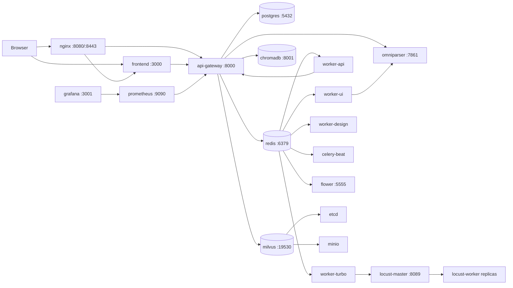

# ChongMing 部署说明

`deploy/` 保存重明平台的容器化和集群部署配置，包括 Docker Compose、Kubernetes、Nginx、Prometheus、OpenAPI、数据库初始化和 Locust 压测入口。

## 目录结构

```text
deploy/
├── docker-compose.yml       # 本地/单机部署主配置
├── .env.example             # 环境变量模板
├── init.sql                 # PostgreSQL 初始化脚本
├── openapi.yaml             # OpenAPI 规格
├── prometheus.yml           # Prometheus 配置
├── nginx/nginx.conf         # 反向代理配置
├── kubernetes/chongming.yaml# Kubernetes 部署清单
└── locust/locustfile.py     # Locust 默认压测脚本
```

`deploy/volumes/` 是运行期数据目录，不应作为设计文档来源。

## Docker Compose 拓扑

`docker-compose.yml` 使用 `chongming-net` bridge 网络，并定义 PostgreSQL、Redis、ChromaDB、Milvus、OmniParser、Locust、监控和前后端服务。



## 服务清单

| 服务 | 端口 | 职责 | 关键依赖 |
|---|---:|---|---|
| `api-gateway` | `8000` | FastAPI API 网关，挂载 `/api/v1` | PostgreSQL、Redis、ChromaDB、Milvus |
| `frontend` | `3000` | Next.js 前端 | API Gateway |
| `worker-ui` | 无公开端口 | UI/视觉测试执行队列 | Redis、API、OmniParser |
| `worker-api` | 无公开端口 | API 测试执行队列 | Redis、API |
| `worker-turbo` | 无公开端口 | Turbo 性能任务队列 | Redis |
| `worker-design` | 无公开端口 | Neural Design 需求解析队列 | Redis、ChromaDB、LLM Key |
| `celery-beat` | 无公开端口 | 定时任务调度 | Redis |
| `flower` | `5555` | Celery 监控 | Redis |
| `postgres` | `5432` | 主业务数据库 | `init.sql` |
| `redis` | `6379` | Celery broker/cache | 持久化卷 |
| `chromadb` | `8001` | 项目知识库向量检索 | 持久化卷 |
| `milvus` | `19530`、`9091` | 缺陷知识库向量检索 | etcd、minio |
| `etcd` | 内网 | Milvus 元数据 | 本地 volume |
| `minio` | 内网 | Milvus 对象存储 | 本地 volume |
| `omniparser` | `7861` | UI 视觉识别服务 | GPU 推荐 |
| `locust-master` | `8089` | Locust 控制台和 master | Locust workers |
| `locust-worker` | 无公开端口 | 压测 worker 副本 | Locust master |
| `prometheus` | `9090` | 指标采集 | `prometheus.yml` |
| `grafana` | `3001` | 指标看板 | Prometheus |
| `nginx` | `8080`、`8443` | 前后端反向代理 | API、Frontend |

## 快速启动

```bash
cd deploy
cp .env.example .env
# 编辑 .env，至少填写 QWEN_API_KEY，按需修改 DB_PASSWORD、Grafana/Flower 密码等
docker-compose up -d
```

常用检查：

```bash
docker-compose ps
docker-compose logs -f api-gateway
docker-compose logs -f worker-ui worker-api worker-design worker-turbo
```

访问入口：

- 前端：`http://localhost:3000`
- API 文档：`http://localhost:8000/docs`
- Flower：`http://localhost:5555`
- Locust：`http://localhost:8089`
- Prometheus：`http://localhost:9090`
- Grafana：`http://localhost:3001`
- Nginx：`http://localhost:8080`

## 关键环境变量

| 变量 | 说明 |
|---|---|
| `VERSION` | 镜像 tag，默认 `latest` |
| `DB_PASSWORD` | PostgreSQL 密码，默认 `chongming123` |
| `QWEN_API_KEY` | LLM 调用 Key，生产必须设置 |
| `QWEN_BASE_URL` | Qwen 兼容 API 地址 |
| `LOG_LEVEL` | API 日志级别 |
| `FLOWER_USER` / `FLOWER_PASSWORD` | Flower 登录凭据 |
| `GRAFANA_USER` / `GRAFANA_PASSWORD` | Grafana 登录凭据 |

API 容器还会设置：

- `DATABASE_URL=postgresql+asyncpg://...@postgres:5432/chongming`
- `REDIS_URL=redis://redis:6379/0`
- `CELERY_BROKER_URL=redis://redis:6379/1`
- `CELERY_RESULT_BACKEND=redis://redis:6379/2`
- `CHROMADB_HOST=chromadb`
- `MILVUS_HOST=milvus`
- `OMNIPARSER_URL=http://omniparser:8002`

## Worker 队列

Compose 文件按能力拆分 worker：

```text
worker-ui      -> celery -A app.worker:celery worker -Q ui_queue
worker-api     -> celery -A app.worker:celery worker -Q api_queue
worker-turbo   -> celery -A app.worker:celery worker -Q turbo_queue
worker-design  -> celery -A app.worker:celery worker -Q design_queue
```

后端 `app/worker.py` 中的代码级队列为 `execution`、`design`、`phoenix`、`turbo`、`high`、`normal`、`low`。如果容器队列名与代码路由不一致，应优先统一 Compose 和 `app/worker.py`，否则任务可能无法被对应 worker 消费。

## 数据和卷

Compose 顶层声明的命名卷：

- `postgres_data`
- `redis_data`
- `chromadb_data`
- `milvus_data`
- `omniparser_models`
- `test_assets`
- `recordings`
- `reports`
- `logs`

另外 `etcd` 和 `minio` 当前挂载到 `deploy/volumes/...`。这些目录是运行期状态，不建议提交或手动编辑。

## 本地开发 vs 容器部署

| 场景 | 推荐方式 |
|---|---|
| 前端页面开发 | 本机 `cd frontend && npm run dev`，后端指向 `localhost:8000` |
| 后端 API 开发 | 本机 `uvicorn app.main:app --reload --port 8000`，按需启动 Redis/Celery |
| 完整链路联调 | `cd deploy &&docker-compose up -d` |
| 视觉 UI 调试 | 确认 OmniParser 可访问，GPU 环境优先 |
| 性能压测 | 使用 Turbo API 或 Locust Web UI |

## Kubernetes

Kubernetes 清单位于 `kubernetes/chongming.yaml`。部署前需要准备：

- Kubernetes 1.25+
- 可用 StorageClass
- Secret：数据库密码、LLM API Key 等
- 如果启用 OmniParser GPU，集群需要 NVIDIA GPU Operator 或等效能力

基础命令：

```bash
kubectl apply -f kubernetes/chongming.yaml
kubectl create secret generic chongming-secrets \
  --namespace=chongming \
  --from-literal=DATABASE_PASSWORD=change-me \
  --from-literal=QWEN_API_KEY=change-me
kubectl get pods -n chongming
kubectl get svc -n chongming
```

## 故障排查

```bash
# API 日志
docker-compose logs -f api-gateway

# Worker 日志
docker-compose logs -f worker-ui worker-api worker-design worker-turbo

# Redis 连通性
docker-compose exec redis redis-cli ping

# PostgreSQL 健康检查
docker-compose exec postgres pg_isready -U chongming

# 进入 API 容器
docker-compose exec api-gateway /bin/bash
```

常见问题：

- 前端请求失败：检查 `NEXT_PUBLIC_API_URL`、CORS、API 是否监听 `8000`。
- 执行任务一直 pending：检查 Celery 队列名、Redis、worker 是否消费正确队列。
- 视觉用例失败：检查 `OMNIPARSER_URL`、OmniParser 容器日志、GPU/模型权重。
- 缺陷检索失败：检查 Milvus、etcd、minio 三个服务状态。
- 压测没有指标：检查 Locust master/worker、Turbo 生成的 test id 和 stats 路径。

## 文档和校验

- API 规格：`openapi.yaml`，运行 API 后也可访问 `/docs`。
- 架构图：`../docs/diagrams/`。
- 修改 Mermaid 图后运行：`python ../scripts/check_mermaid_diagrams.py`。
- 修改 README 后运行：`python ../scripts/check_utf8.py`。
