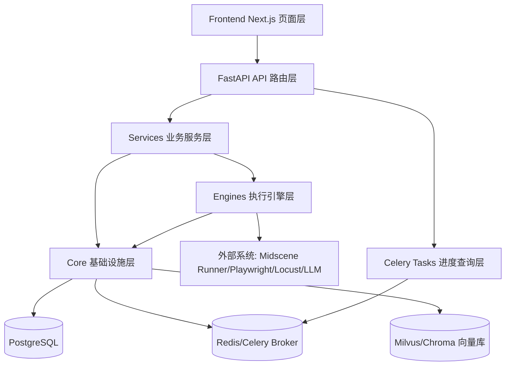
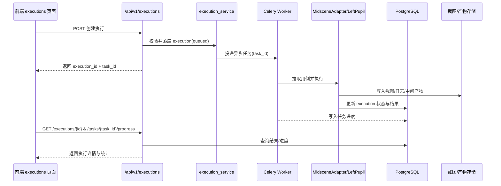

# ChongMing 模块全景说明书（全栈版）

## 1. 文档目标与读者

### 1.1 目标
- 以“模块”为主线，给出 ChongMing 当前代码事实下的全栈架构说明。
- 统一描述口径：每个模块固定输出功能定位、技术作用、优化面、验收指标。
- 为研发协作、架构评审、测试设计、后续重构提供单一事实来源（Single Source of Truth）。

### 1.2 读者
- 后端研发工程师
- 前端研发工程师
- 测试工程师 / SDET
- 架构评审与项目管理人员

### 1.3 范围与边界
- 范围内：后端、前端、部署、CI、测试体系、跨模块链路、优化路线。
- 范围外：鉴权体系、RBAC、密钥托管（KMS/Vault）实施细节。

## 2. 系统模块总览图（分层 + 调用关系）

## 3. 模块详解（逐模块固定模板）

> 模板字段：模块边界 / 核心功能 / 技术作用 / 关键依赖 / 当前问题 / 优化面（P0/P1/P2）/ 验收指标

---

### 3.1 平台入口与治理层

#### 模块边界
- `backend/app/main.py`
- `backend/app/api/v1/router.py`

#### 核心功能
- 应用生命周期管理（启动、关闭、依赖初始化）。
- API v1 路由聚合与统一挂载。
- 中间件装配（日志、CORS）。

#### 技术作用
- 作为平台总入口，统一控制启动行为与对外 API 暴露边界。
- 保证不同业务模块在同一治理规则下运行。

#### 关键依赖
- `app.core.config`
- `app.core.logging`
- `app.worker`

#### 当前问题
- 历史注释与文案存在乱码，影响可读性与维护效率。

#### 优化面
- P0：统一入口层注释编码为 UTF-8，修复关键注释乱码。
- P1：补齐启动阶段健康检查（DB/Redis/向量库）可观测日志。
- P2：引入模块级 feature flag 以支持灰度开关。

#### 验收指标
- 启动日志关键字段可读率 100%（无乱码）。
- 启动失败可定位时间 < 10 分钟。

---

### 3.2 后端 API 模块层（按 endpoint）

#### 模块边界
- `backend/app/api/v1/endpoints/*.py`
- 路由前缀见：`backend/app/api/v1/router.py`

#### 核心功能
- 对外提供健康检查、测试用例管理、执行管理、神经设计、凤凰涅槃、任务进度、API 自动化、性能测试、智能运维、视觉 UI、环境管理、数据工厂、看板聚合等能力。

#### 技术作用
- 作为前后端契约层，屏蔽下层服务/引擎实现复杂度。
- 为异步执行和多引擎能力提供统一 API 入口。

#### 关键依赖
- `services/*`
- `schemas/*`
- `core/*`
- `tasks/*`

#### 当前问题
- 存在历史双入口能力重叠（`/left-pupil` 与 `/api-engine`）。
- 个别模块经历过重复路由声明问题（已修复，但需长期防回归）。

#### 优化面
- P0：严格执行“主入口 + 兼容层”策略（`/left-pupil` 主，`/api-engine` 兼容）。
- P1：统一错误码与响应 envelope（message/code/data）。
- P2：为高频查询接口补充缓存与批量接口设计。

#### 验收指标
- OpenAPI 路由唯一性检查通过率 100%。
- 兼容层接口行为与主入口一致性 > 95%。

---

### 3.3 业务服务层（Services）

#### 模块边界
- 通用服务：
  - `backend/app/services/execution_service.py`
  - `backend/app/services/test_case_service.py`
  - `backend/app/services/environment_manager.py`
  - `backend/app/services/data_factory.py`
  - `backend/app/services/visual_ui_service.py`
- 子域服务：
  - `backend/app/services/left_pupil/*`
  - `backend/app/services/neural_design/*`
  - `backend/app/services/phoenix/*`
  - `backend/app/services/smart_ops/*`

#### 核心功能
- 承接 API 层请求，封装业务规则、流程编排与数据操作。
- 聚合引擎能力（执行、解析、推理、比对、治理）。

#### 技术作用
- 形成清晰业务边界，降低 API 层与引擎层耦合。
- 是可测试性与可替换性的关键层。

#### 关键依赖
- `models/*`, `schemas/*`, `engines/*`, `core/*`

#### 当前问题
- 部分服务边界随功能增长变宽，职责渐重。
- 历史代码风格与注释规范不一致。

#### 优化面
- P0：高复杂服务拆分（执行管理、左瞳依赖规划、缺陷分析）为更细粒度组件。
- P1：引入服务层统一 tracing（request_id / execution_id / task_id）。
- P2：建立服务层稳定接口（protocol）便于 mock 与替换。

#### 验收指标
- 核心服务单元测试覆盖率 > 80%。
- 单服务文件圈复杂度下降趋势（按季度追踪）。

---

### 3.4 引擎层（Engines）

#### 模块边界
- `backend/app/services/midscene_adapter.py`
- `backend/app/services/visual_ui_service.py`
- `backend/app/engines/left_pupil/*`
- `backend/app/engines/runner/*`
- `backend/app/engines/turbo/*`
- `backend/app/engines/master_dispatcher/*`

#### 核心功能
- Midscene：Visual UI 自动化执行与视觉驱动策略。
- 左瞳：API 自动化执行、依赖规划与断言能力。
- Runner：用例加载与执行器封装。
- Turbo：性能测试脚本编译、执行、数据合成。
- Master Dispatcher：API 执行策略路由。

#### 技术作用
- 是平台核心“能力层”，承载差异化执行能力与 AI 增强能力。
- 通过引擎化设计支撑后续横向扩展（新执行器/新模型）。

#### 关键依赖
- Playwright、Locust、LLM Provider、图像处理库。

#### 当前问题
- 引擎行为可观测性颗粒度不一致。
- 部分引擎结果结构未完全统一。

#### 优化面
- P0：统一执行 trace schema（step_id、agent、cost、latency）。
- P1：引擎输出标准化（pass/fail/error_reason/artifacts）。
- P2：引擎插件化，支持第三方执行器接入。

#### 验收指标
- 引擎级失败分类可归因率 > 90%。
- 新引擎接入改动文件数下降（目标 < 6 个）。

---

### 3.5 领域模型与 Schema 层

#### 模块边界
- `backend/app/models/*`
- `backend/app/schemas/*`

#### 核心功能
- `models` 负责持久化对象定义。
- `schemas` 负责 API 输入输出约束、类型校验与文档化。

#### 技术作用
- 为数据库、服务与 API 提供稳定的数据契约层。
- 降低隐式字段耦合与类型漂移风险。

#### 关键依赖
- SQLAlchemy
- Pydantic

#### 当前问题
- 跨模块字段语义一致性仍需持续治理。

#### 优化面
- P0：统一命名规范（id/status/error/message 等基础字段）。
- P1：增加 schema contract test（对 OpenAPI 快照断言）。
- P2：引入版本化 schema（重大变更可并行演进）。

#### 验收指标
- 关键接口类型破坏性变更漏检率为 0。

---

### 3.6 基础设施层（Core + Celery）

#### 模块边界
- `backend/app/core/*`
- `backend/app/api/v1/endpoints/tasks.py`
- `backend/app/worker.py`

#### 核心功能
- 配置加载与环境分层（dev/staging/prod）。
- 数据库连接与初始化。
- 日志、请求追踪、限流、AI 客户端管理。
- Celery 异步任务执行与进度查询。

#### 技术作用
- 提供平台运行基座，决定稳定性与可运维性。
- 支撑异步任务模型与任务可观测能力。

#### 关键依赖
- PostgreSQL
- Redis / Broker
- Celery / Flower

#### 当前问题
- 历史上存在开发与生产配置语义混杂风险（已进入治理轨道，需持续约束）。

#### 优化面
- P0：严格环境校验 fail-fast，阻断生产误配置。
- P1：统一结构化日志字段，打通 API/Service/Task 关联。
- P2：引入任务重试与幂等策略模板库。

#### 验收指标
- 生产配置违规启动拦截率 100%。
- 任务链路关联 ID 覆盖率 > 95%。

---

### 3.7 前端应用层（Next.js）

#### 模块边界
- `frontend/src/app/*`
- 核心页面：`api-auto`, `design`, `executions`, `model-config`, `performance`, `phoenix`, `smart-ops`, `turbo`, `visual-ui`, `settings`

#### 核心功能
- 承载测试设计、执行监控、智能运维、性能测试、视觉测试等业务入口。
- 作为 API 能力的可视化编排与管理界面。

#### 技术作用
- 将复杂后端能力产品化，降低操作门槛。
- 形成“配置-执行-回看-治理”闭环操作体验。

#### 关键依赖
- Next.js / React / TypeScript
- React Query / Axios

#### 当前问题
- 页面与后端能力映射文档存在断层，新增功能学习成本高。

#### 优化面
- P0：页面到 API 映射表纳入主文档并强制维护。
- P1：统一页面错误提示与重试策略。
- P2：加入页面级性能指标采集（TTFB、交互响应）。

#### 验收指标
- 新人定位“页面对应接口”耗时 < 15 分钟。
- 页面关键操作失败重试成功率提升。

---

### 3.8 部署与运行保障层（Deploy + CI + Scripts）

#### 模块边界
- `deploy/*`
- `.github/workflows/backend-ci.yml`
- `scripts/check_utf8.py`

#### 核心功能
- Docker/K8s 部署资源与示例配置。
- CI 自动化验证（单测、安全/配置专项、Redis broker smoke、编码检查）。
- UTF-8 守卫脚本保障文档/代码编码质量。

#### 技术作用
- 把“研发规范”转化为自动化门禁，防止回归。
- 为多环境部署与持续集成提供标准路径。

#### 关键依赖
- GitHub Actions
- Docker / Kubernetes / Redis

#### 当前问题
- 部署文档历史内容存在编码与术语不统一问题。

#### 优化面
- P0：部署文档 UTF-8 化与术语统一。
- P1：补齐 e2e smoke（核心链路）。
- P2：增加 DORA 指标与发布质量看板。

#### 验收指标
- CI 对高风险回归拦截率持续提升。
- 部署文档首轮执行成功率显著提升。

## 4. 跨模块关键链路（从点执行到结果入库）

### 4.1 链路时序图

### 4.2 链路关键控制点
- 输入校验：execution 创建参数与用例存在性。
- 安全控制：截图读取路径白名单 + `Path.resolve()` 根目录约束。
- 异步可观测：`execution_id` 与 `task_id` 双 ID 贯通。
- 结果落库：状态流转 `queued -> running -> completed/failed/cancelled`。

## 5. 模块优化路线图（P0/P1/P2）

### 5.1 P0（本期必须）
- 编码与文案治理：清理关键文档与注释乱码，统一 UTF-8。
- 路由与接口治理：坚持 `/left-pupil` 主入口、`/api-engine` 兼容层。
- 配置门禁：环境分层 + 违规配置 fail-fast。
- 路径安全：截图路径安全策略统一与测试固化。

### 5.2 P1（近期增强）
- 响应模型标准化与错误码收敛。
- 服务/引擎 tracing 统一，提升故障定位效率。
- 页面/API 映射表持续维护并纳入评审检查项。

### 5.3 P2（中长期演进）
- 引擎插件化与扩展协议。
- 版本化 schema 与迁移治理。
- 发布质量与运维指标平台化（DORA + 业务指标）。

## 6. 现状风险与技术债对齐（映射既有问题）

| 风险项 | 严重级别 | 现状 | 模块归属 | 治理策略 |
|---|---|---|---|---|
| 敏感配置打印风险 | High | 已修复并需防回归 | Core/Logging | 结构化日志 + 脱敏规则 + CI 检查 |
| 截图读取路径拼接风险 | High | 已修复并需持续测试 | Executions/Service | 白名单正则 + resolve 校验 + 攻击样例测试 |
| dev/prod 配置混杂风险 | Medium | 已建立分层，需长期约束 | Core/Celery | APP_ENV 策略 + broker smoke |
| Smart Ops 路由结构风险 | Medium | 已修复，需防重复注册 | API/Smart Ops | OpenAPI 唯一路径测试 |
| 双 API 自动化入口认知成本 | Medium | 主/兼容已定义 | API/Left Pupil | 明确迁移文档与 sunset 策略 |
| 编码/文案混乱 | Low | 仍需分批治理 | 全模块 | UTF-8 guard + 文案规范 |

## 7. 附录：模块-接口-页面-代码路径矩阵

| 业务模块 | API 前缀 | 前端页面 | 关键后端代码 |
|---|---|---|---|
| 健康检查 | `/api/v1/health` | `frontend/src/app/page.tsx`（间接依赖） | `backend/app/api/v1/endpoints/health.py` |
| 测试用例管理 | `/api/v1/test-cases` | `frontend/src/app/design/page.tsx`、`frontend/src/app/executions/page.tsx` | `backend/app/api/v1/endpoints/test_cases.py` |
| 执行管理 | `/api/v1/executions` | `frontend/src/app/executions/page.tsx` | `backend/app/api/v1/endpoints/executions.py`、`backend/app/services/execution_service.py` |
| 神经设计 | `/api/v1/design` | `frontend/src/app/design/page.tsx` | `backend/app/api/v1/endpoints/design.py`、`backend/app/services/neural_design/service.py` |
| 凤凰涅槃 | `/api/v1/phoenix` | `frontend/src/app/phoenix/page.tsx` | `backend/app/api/v1/endpoints/phoenix.py`、`backend/app/services/phoenix/service.py` |
| 任务进度 | `/api/v1/tasks` | `frontend/src/app/executions/page.tsx` | `backend/app/api/v1/endpoints/tasks.py` |
| API 自动化主入口 | `/api/v1/left-pupil` | `frontend/src/app/api-auto/page.tsx` | `backend/app/api/v1/endpoints/left_pupil.py`、`backend/app/services/left_pupil/engine.py` |
| API 自动化兼容层 | `/api/v1/api-engine` | `frontend/src/app/api-auto/page.tsx`（兼容调用） | `backend/app/api/v1/endpoints/api_engine.py` |
| 性能测试 | `/api/v1/turbo` | `frontend/src/app/turbo/page.tsx`、`frontend/src/app/performance/page.tsx` | `backend/app/api/v1/endpoints/turbo.py`、`backend/app/engines/turbo/*` |
| 智能运维 | `/api/v1/smart-ops` | `frontend/src/app/smart-ops/page.tsx`、`frontend/src/app/model-config/page.tsx` | `backend/app/api/v1/endpoints/smart_ops.py`、`backend/app/services/smart_ops/*` |
| 视觉 UI | `/api/v1/visual-ui` | `frontend/src/app/visual-ui/page.tsx` | `backend/app/api/v1/endpoints/visual_ui.py`、`backend/app/services/visual_ui_service.py` |
| 环境管理 | `/api/v1/environments` | `frontend/src/app/settings/page.tsx` | `backend/app/api/v1/endpoints/environments.py`、`backend/app/services/environment_manager.py` |
| 数据工厂 | `/api/v1/data-factory` | `frontend/src/app/design/page.tsx`（数据辅助） | `backend/app/api/v1/endpoints/data_factory.py`、`backend/app/services/data_factory.py` |
| 大盘看板 | `/api/v1/dashboard` | `frontend/src/app/page.tsx`、`frontend/src/app/executions/page.tsx` | `backend/app/api/v1/endpoints/dashboard.py` |

## 8. 文档维护约定
- 总览文档为主入口，分册文档只做深入细节，不重复维护同层摘要。
- 每次新增模块或 API 前缀时，必须同步更新本文件附录矩阵。
- 评审门禁：PR 若改动 `backend/app/api/v1/router.py` 或 `frontend/src/app/*`，需检查本文件是否需要更新。

## 9. 测试用例管理专项链接
- 设计分册：[`designs/测试用例管理模块实施说明.md`](designs/测试用例管理模块实施说明.md)
- 测试分册：[`issues/测试用例管理_测试计划.md`](issues/测试用例管理_测试计划.md)
